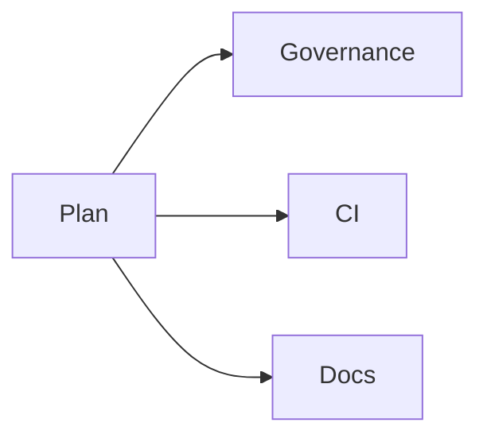
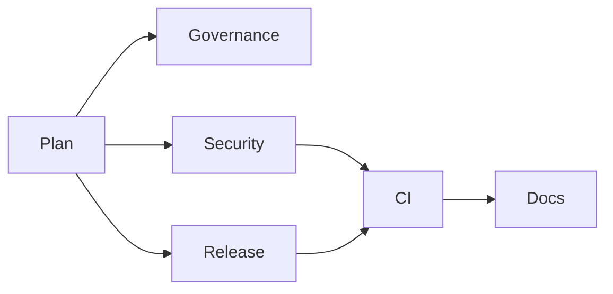
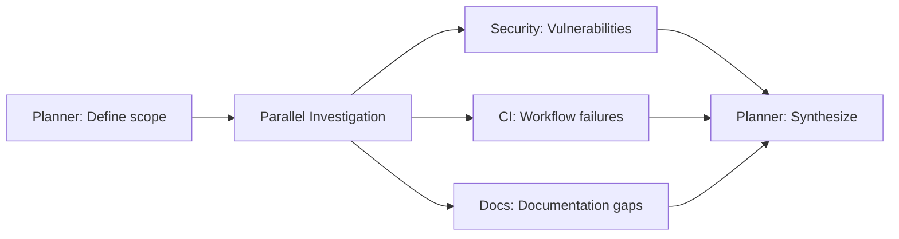

# Swarm Definitions

This document defines coordinated multi-agent "swarms" for complex, cross-cutting tasks.

## Overview

A **swarm** is a coordinated group of custom agents working together to accomplish a complex task that requires multiple domain expertise areas.

**Benefits**:
- **Orchestration**: Coordinate multiple agents in sequence
- **Completeness**: Cover all aspects of complex tasks
- **Consistency**: Standard approach to common multi-step processes
- **Efficiency**: Parallel work where possible

## When to Use Swarms

Use swarms for tasks that:
- Span multiple domains (e.g., governance + CI + docs)
- Require sequential coordination (e.g., plan → implement → validate)
- Are repeatable processes (e.g., new repo setup, releases)
- Benefit from multiple perspectives (e.g., security hardening)

Use individual agents for:
- Single-domain tasks
- Quick questions or validations
- Exploratory work
- Incremental changes

## Core Swarms

### 1. Bootstrap Swarm

**Purpose**: Initialize a new repository with all required structure and configuration

**Trigger**: New Repository Request issue approved

**Agents**:
1. **Planner Agent**: Create task breakdown and timeline
2. **Governance Agent**: Ensure org compliance
3. **CI Automation Agent**: Configure workflows
4. **Docs Agent**: Initialize documentation structure

**Process**:
```
1. Planner: Break down setup tasks
   - Repository creation
   - File structure
   - Workflow configuration
   - Documentation setup
   - Verification

2. Governance: Validate compliance
   - Check required files
   - Configure CODEOWNERS
   - Verify policy-check passes
   - Update coverage matrix

3. CI Automation: Set up workflows
   - Copy workflow templates
   - Customize for tech stack
   - Configure secrets
   - Test workflow execution

4. Docs: Initialize docs
   - Create docs/ structure
   - Write initial README
   - Set up architecture docs
   - Create runbook templates
```

**Input**:
- Repository name
- Description
- Owner team
- Primary language/stack
- Optional modules

**Output**:
- Fully configured repository
- All required files present
- Workflows operational
- Documentation structure ready
- Initial issues for next steps

**Example Usage**:
```
Open "Swarm Run" issue:
Swarm type: Bootstrap Swarm
Objective: Initialize payment-service repository
Scope: ORG_NAME/payment-service
- Language: TypeScript
- Owner: @org/payments-team
- Modules: DevContainer, Security scanning
```

### 2. Security Hardening Swarm

**Purpose**: Apply comprehensive security best practices to a repository

**Trigger**: Security audit, compliance requirement, or manual request

**Agents**:
1. **Security Agent**: Identify vulnerabilities and hardening opportunities
2. **Governance Agent**: Ensure hardening aligns with org policies
3. **CI Automation Agent**: Implement security scanning workflows
4. **Docs Agent**: Document security architecture and procedures

**Process**:
```
1. Security: Audit current state
   - Scan for vulnerabilities
   - Review dependencies
   - Check secrets management
   - Identify hardening opportunities

2. Governance: Validate alignment
   - Check security controls in coverage matrix
   - Verify CODEOWNERS for sensitive paths
   - Ensure security workflows required

3. CI Automation: Implement scanning
   - Add CodeQL workflow
   - Configure Dependabot
   - Set up secret scanning
   - Integrate security checks in CI

4. Docs: Document security
   - Update SECURITY.md
   - Document threat model
   - Create security runbooks
   - Update architecture diagrams
```

**Input**:
- Target repository
- Compliance requirements (if any)
- Current security posture
- Timeline

**Output**:
- Security vulnerabilities identified and remediated
- Security scanning workflows active
- Security documentation updated
- Coverage matrix updated

**Example Usage**:
```
Open "Swarm Run" issue:
Swarm type: Security Hardening Swarm
Objective: Prepare for SOC 2 audit
Scope: ORG_NAME/api-gateway
Constraints: 2 weeks, no breaking changes
```

### 3. Release Swarm

**Purpose**: Coordinate release preparation, validation, and deployment

**Trigger**: Release planning meeting or manual request

**Agents**:
1. **Planner Agent**: Create release plan and timeline
2. **Release Agent**: Coordinate release activities
3. **CI Automation Agent**: Prepare deployment automation
4. **Security Agent**: Security validation
5. **Docs Agent**: Prepare release documentation

**Process**:
```
1. Planner: Create release plan
   - Define scope (features, fixes)
   - Identify dependencies
   - Set timeline and milestones
   - Plan communication

2. Release: Coordinate activities
   - Version bumping (semantic versioning)
   - Changelog generation
   - Migration guide (if breaking changes)
   - Release notes

3. CI Automation: Prepare deployment
   - Update deployment workflows
   - Configure release pipeline
   - Set up rollback procedures
   - Test deployment process

4. Security: Validate release
   - Scan for vulnerabilities
   - Review security changes
   - Approve from security perspective

5. Docs: Prepare documentation
   - Update README if needed
   - Write migration guide
   - Update API docs
   - Prepare announcement
```

**Input**:
- Release version
- Scope (features, fixes, breaking changes)
- Target date
- Deployment requirements

**Output**:
- Release plan document
- Changelog and release notes
- Migration guide (if needed)
- Deployment automation tested
- Security sign-off
- Documentation updated

**Example Usage**:
```
Open "Swarm Run" issue:
Swarm type: Release Swarm
Objective: Release v2.0.0 with breaking API changes
Scope: ORG_NAME/api-gateway
Timeline: 3 weeks
Breaking changes: Yes (auth flow update)
```

## Swarm Coordination

### Sequential Execution

Agents execute in order, each building on previous work:

```
Planner → Governance → CI → Docs
```

**When to use**: Tasks require outputs from previous steps

### Parallel Execution

Multiple agents work simultaneously on independent tasks:



**When to use**: Tasks are independent and can be parallelized

### Hybrid Execution

Combination of sequential and parallel:



**When to use**: Complex workflows with both dependencies and parallelism

## Creating Custom Swarms

### Define the Swarm

1. **Identify the need**: What complex task is repeated?
2. **Select agents**: Which agents should participate?
3. **Define process**: What's the sequence of activities?
4. **Document inputs/outputs**: What's needed and produced?

### Document the Swarm

Add to this file:
- Purpose and trigger
- Agent roster
- Process flow
- Input requirements
- Expected output
- Example usage

### Create Issue Template (Optional)

For frequently used swarms, create an issue template:

```yaml
name: [Swarm Name]
description: [Description]
title: "[Swarm]: "
labels: [swarm, automation]
body:
  # Include fields for swarm inputs
```

### Test the Swarm

1. Run on test repository
2. Verify coordination between agents
3. Validate outputs
4. Refine process as needed

## Best Practices

### For Swarm Definition

1. **Clear purpose**: One swarm, one high-level goal
2. **Right agents**: Include all necessary expertise
3. **Defined process**: Document the sequence clearly
4. **Reusable**: Design for repeated use
5. **Flexible**: Allow customization for specific cases

### For Swarm Execution

1. **Clear objective**: State what you want to accomplish
2. **Complete inputs**: Provide all required information
3. **Track progress**: Update the issue as swarm progresses
4. **Validate outputs**: Review agent work at each step
5. **Document learnings**: Improve the swarm based on experience

### For Swarm Coordination

1. **One coordinator**: Designate someone to orchestrate
2. **Communication**: Keep all context in the issue
3. **Checkpoints**: Validate after each major step
4. **Flexibility**: Adjust if needed, don't blindly follow
5. **Completion**: Verify all success criteria met

## Common Patterns

### Investigation Swarm

Coordinate multiple agents to investigate a complex problem:



### Migration Swarm

Coordinate migration to new patterns or tools:

```
Planner (migration plan) →
Governance (validate alignment) →
CI (update workflows) +
Docs (migration guide) →
Release (coordinate rollout)
```

### Compliance Swarm

Ensure repository meets compliance requirements:

```
Security (audit security controls) +
Governance (check policy compliance) →
CI (implement required checks) →
Docs (document compliance posture) →
Planner (identify remaining gaps)
```

## Swarm Metrics

Track swarm effectiveness:

- **Completion rate**: % of swarms that fully complete
- **Time to complete**: Duration from trigger to completion
- **Quality**: Issues found post-swarm
- **User satisfaction**: Feedback from swarm requesters

Review quarterly and refine swarms based on metrics.

## Related Documentation

- [Custom Agent Roster](custom-agents.md)
- [Swarm Run Issue Template](https://github.com/ORG_NAME/.github/blob/main/.github/ISSUE_TEMPLATE/swarm-run.yml)
- [Agent Profiles](../../templates/repo-template/.github/agents/)
- [Automation Map Diagram](../diagrams/automation-map.mmd)

## Questions?

For questions about swarms:
- Open an issue with "devex" label
- Tag @org/platform-team
- See [SUPPORT.md](https://github.com/ORG_NAME/.github/blob/main/SUPPORT.md)
