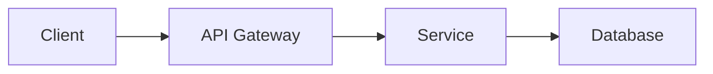

# Documentation Instructions

## Context

This repository follows documentation standards from the **c-sollad-org1 Dev Workflow OS v1**. Good documentation is a core deliverable, not an afterthought.

## Documentation Principles

1. **Keep it up to date**: Outdated docs are worse than no docs
2. **Write for humans**: Clear, concise, actionable
3. **Show, don't just tell**: Use examples, diagrams, code snippets
4. **Organize logically**: Architecture → How-to → Reference
5. **Link liberally**: Connect related docs, reference source code

## File Structure

```
docs/
├── architecture/
│   ├── README.md          # System overview
│   ├── decisions/         # Architecture Decision Records (ADRs)
│   └── diagrams/          # Mermaid diagrams
├── governance/
│   ├── README.md          # Governance model
│   ├── coverage-matrix.md # Control coverage
│   └── rulesets.md        # Ruleset documentation
└── runbooks/
    ├── README.md          # Index of runbooks
    ├── deployment.md      # Deployment procedures
    └── incident-response.md # Incident handling
```

## README.md Standards

Every README should include:

1. **One-line description**: What is this?
2. **Overview**: Why does this exist?
3. **Getting started**: How do I use it?
4. **Development**: How do I contribute?
5. **Documentation**: Links to deeper docs
6. **Support**: How do I get help?

### Example Structure

```markdown
# Project Name

Brief one-line description.

## Overview

2-3 paragraphs: purpose, key features, use cases.

## Getting Started

### Prerequisites

### Installation

### Usage

## Development

### Building

### Testing

### Linting

## Documentation

- Architecture: `docs/architecture/README.md`
- Runbooks: `docs/runbooks/README.md`

## Contributing

See `CONTRIBUTING.md` (org-level) or the repository's contributing guide.

## License

See `LICENSE`.

## Support

- Open an issue
- Tag @org/team-name
```

## Architecture Documentation

### Overview Documents

- Start with the big picture: What does the system do? How is it structured?
- Include architecture diagrams (Mermaid preferred)
- Document key decisions (use ADRs for significant choices)

### Architecture Decision Records (ADRs)

When making significant architectural decisions, document them:

```markdown
# ADR-001: Use PostgreSQL for Primary Database

**Status**: Accepted
**Date**: 2025-12-16
**Deciders**: @org/backend-team

## Context

We need a relational database for...

## Decision

We will use PostgreSQL because...

## Consequences

Positive:

- High reliability
- Rich ecosystem

Negative:

- Operational complexity
- Cost
```

### Diagrams

Use Mermaid for diagrams (renders in GitHub):



Diagram types:

- System architecture: `graph` or `C4Context`
- Sequence: `sequenceDiagram`
- State machines: `stateDiagram-v2`
- Entity relationships: `erDiagram`

Store diagrams in `docs/architecture/diagrams/*.mmd`

## Runbooks

Runbooks are step-by-step procedures for operational tasks:

### Structure

````markdown
# Runbook: Task Name

## Purpose

What does this accomplish?

## Prerequisites

- Access needed
- Tools required
- Context/timing

## Procedure

1. Step one with command:
   ```bash
   command here
   ```
````

Expected output: ...

2. Step two...

## Verification

How to confirm success?

## Rollback

If something goes wrong...

## Troubleshooting

Common issues and fixes.

## Related

- Related runbook: `docs/runbooks/<runbook>.md`
- Related architecture doc: `docs/architecture/<doc>.md`

````

## Code Comments vs. Documentation

- **Code comments**: Explain *why* (intent, non-obvious decisions)
- **Docs**: Explain *what* and *how* (usage, architecture, procedures)

Avoid comments that just restate code:

```typescript
// Bad: Increments counter
counter++;

// Good: Track retry attempts for exponential backoff
retryAttempts++;
````

## Updating Documentation

When to update docs:

- ✅ Changing public APIs or interfaces
- ✅ Adding new features
- ✅ Changing deployment or build procedures
- ✅ Making architectural decisions
- ✅ Discovering gotchas or edge cases

How to update:

1. Update docs in the same PR as code changes
2. Link to relevant issues or discussions
3. Mark deprecated sections clearly
4. Remove obsolete docs (don't leave stale content)

## Documentation Review

Before merging:

- [ ] All code changes have corresponding doc updates
- [ ] Links work (no 404s)
- [ ] Diagrams render correctly
- [ ] Commands/examples are tested
- [ ] Spelling and grammar checked

## Diagramming Best Practices

### Use the Right Diagram Type

- **System architecture**: Show components and data flow
- **Sequence diagrams**: Show interactions over time
- **State machines**: Show state transitions and lifecycle
- **ER diagrams**: Show data models

### Keep Diagrams Simple

- One diagram = one concept
- 5-10 nodes max
- Label clearly
- Use consistent shapes/colors

### Maintain Diagrams

- Store as code (Mermaid `.mmd` files)
- Version control with the code
- Regenerate when architecture changes

## Resources

- [Mermaid syntax](https://mermaid.js.org/intro/)
- [ADR template](https://github.com/joelparkerhenderson/architecture-decision-record)
- [Org docs standards](https://github.com/ORG_NAME/dev-workflow-os/tree/main/docs/standards)
