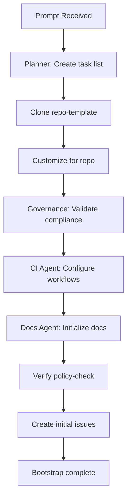

# Prompt: New Repository Bootstrap

## Purpose

Bootstrap a new repository with all required files, workflows, and configuration according to ORG_NAME standards.

## Context

This prompt coordinates the **Bootstrap Swarm** to initialize a new repository from the repo-template. Use this when creating a new repository in the organization.

## Prerequisites

- Repository created on GitHub (via "New Repo Request" issue)
- Repository owner team identified
- Primary language/stack determined

## Prompt Template

```
Bootstrap repository: ORG_NAME/[REPO_NAME]

Repository details:
- Name: [REPO_NAME]
- Description: [ONE_LINE_DESCRIPTION]
- Owner team: @org/[TEAM_NAME]
- Primary language: [LANGUAGE]
- Visibility: [PUBLIC|PRIVATE]

Optional modules:
- [ ] DevContainer configuration
- [ ] Advanced CI/CD pipelines
- [ ] Security scanning
- [ ] Code coverage tracking

Tasks:
1. Initialize from repo-template
2. Customize README.md with repo-specific content
3. Update LICENSE with current year
4. Configure CODEOWNERS with owner team
5. Set up language-specific .gitignore
6. Configure CI workflow for [LANGUAGE]
7. Add required GitHub secrets (if needed)
8. Enable required branch protections
9. Configure GitHub Projects integration
10. Create initial documentation structure
11. Verify policy-check workflow passes
12. Create initial issues for next steps

Success criteria:
- [ ] All required files present
- [ ] Workflows configured and passing
- [ ] CODEOWNERS properly set
- [ ] Documentation skeleton in place
- [ ] Copilot instructions customized
- [ ] Initial issues created
```

## Agents Involved

This prompt activates the **Bootstrap Swarm**:

1. **Planner Agent**: Creates task breakdown and timeline
2. **Governance Agent**: Ensures org compliance
3. **CI Automation Agent**: Configures workflows
4. **Docs/Diagrams Agent**: Sets up documentation structure

## Execution Flow



## Customization Points

### By Language

**Node.js/TypeScript**:
- Use `npm` or `yarn` in CI
- Add `package.json`, `tsconfig.json`
- Configure ESLint, Prettier

**Python**:
- Use `pip` with `requirements.txt` or `poetry`
- Add `pyproject.toml`
- Configure `black`, `flake8`, `mypy`

**Go**:
- Use `go mod` for dependencies
- Add `go.mod`, `go.sum`
- Configure `golangci-lint`

**Java**:
- Use Maven or Gradle
- Add `pom.xml` or `build.gradle`
- Configure Checkstyle

### By Project Type

**Service/API**:
- Add API documentation structure
- Include deployment runbooks
- Add health check endpoints

**Library**:
- Add usage examples
- Include API reference
- Configure package publishing

**Tool/CLI**:
- Add command documentation
- Include installation instructions
- Add usage examples

## Post-Bootstrap Steps

After bootstrap completes:

1. Review and merge bootstrap PR
2. Clone repository locally
3. Verify local build and test
4. Set up any external integrations (CI secrets, etc.)
5. Communicate to team
6. Start development

## Example

```
Bootstrap repository: ORG_NAME/payment-service

Repository details:
- Name: payment-service
- Description: Handles payment processing and billing
- Owner team: @org/payments-team
- Primary language: TypeScript
- Visibility: PRIVATE

Optional modules:
- [x] DevContainer configuration
- [x] Advanced CI/CD pipelines
- [x] Security scanning
- [x] Code coverage tracking

Tasks:
[Standard task list from template above]

Success criteria:
[Standard criteria from template above]
```

## Related

- [Governance Agent](../agents/governance.agent.md)
- [CI Automation Agent](../agents/ci-automation.agent.md)
- [Repo Template](https://github.com/ORG_NAME/repo-template)
- [Dev Workflow OS](https://github.com/ORG_NAME/dev-workflow-os)
