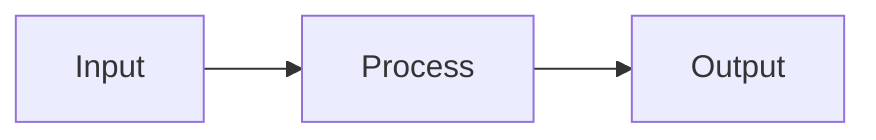

# Architecture

This directory contains architecture documentation for this repository.

## Contents

- **Overview**: System architecture and design
- **Decisions**: Architecture Decision Records (ADRs)
- **Diagrams**: Visual representations of the system

## System Overview

<!-- Describe the high-level architecture -->

This repository implements...

### Key Components

<!-- List and describe major components -->

1. **Component 1**: Description
2. **Component 2**: Description
3. **Component 3**: Description

### Data Flow

<!-- Describe how data moves through the system -->



### Technology Stack

<!-- List key technologies -->

- **Language**: [Primary language]
- **Framework**: [If applicable]
- **Database**: [If applicable]
- **Infrastructure**: [Hosting, cloud services]

## Architecture Decision Records

Significant architectural decisions are documented in `decisions/` subdirectory using the ADR format.

### Creating a New ADR

```bash
# Create a new ADR file
cp decisions/adr-template.md decisions/adr-NNN-title.md
# Edit the file with your decision
```

### ADR Format

- **Status**: Proposed | Accepted | Deprecated | Superseded by ADR-XXX
- **Context**: What is the issue?
- **Decision**: What are we doing?
- **Consequences**: What are the implications?

## Diagrams

Visual architecture diagrams are maintained in the `diagrams/` subdirectory as Mermaid files (`.mmd`).

### Diagram Types

- **System Architecture**: Overall system structure
- **Sequence Diagrams**: Interaction flows
- **State Machines**: State transitions
- **Data Models**: Entity relationships

### Viewing Diagrams

Mermaid diagrams render automatically in GitHub. To view locally:
- Use VS Code with the Mermaid extension
- Use [Mermaid Live Editor](https://mermaid.live/)

## Related Documentation

- [Governance](../governance/README.md)
- [Runbooks](../runbooks/README.md)
- [Contributing Guide](https://github.com/ORG_NAME/.github/blob/main/CONTRIBUTING.md)

## Questions?

For architecture questions:
- Open an issue with the "architecture" label
- Tag @org/platform-team for infrastructure questions
- Refer to [SUPPORT.md](https://github.com/ORG_NAME/.github/blob/main/SUPPORT.md)
